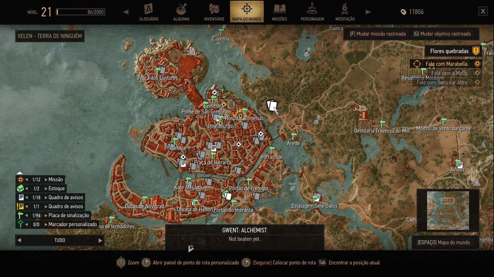
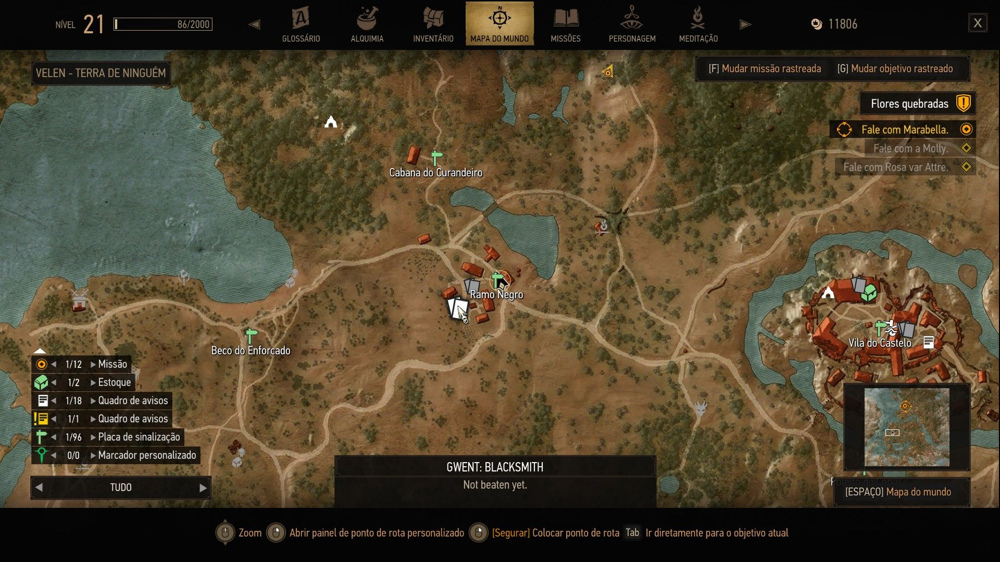
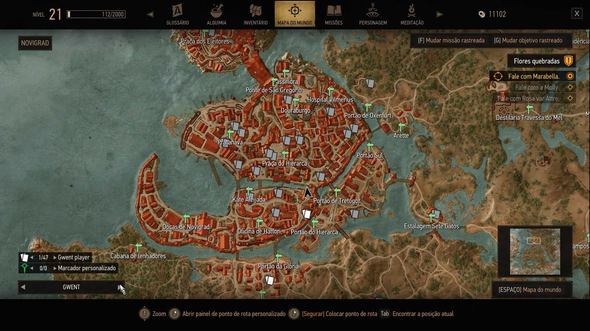
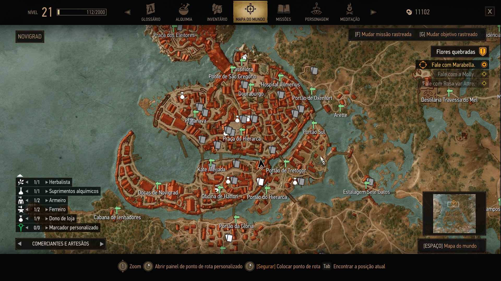
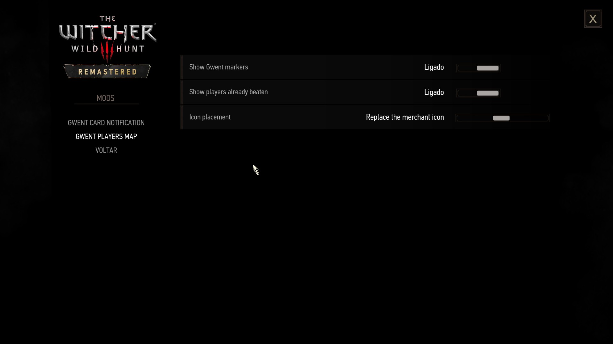

# Gwent Players Map

A small mod for **The Witcher 3: Wild Hunt (Remastered / Next Gen)** that puts every Gwent player you can
challenge on the world map: shopkeepers, blacksmiths, armorers, innkeepers, herbalists and the
other merchants who will play you for a card. The goal is simple: find who still has a card for
you, so you can grow your deck.

Players you have already beaten are drawn greyed out, the same way the game greys out places you
have cleared.

**Download:** [Nexus Mods](https://www.nexusmods.com/witcher3/mods/13755) or
[GitHub Releases](https://github.com/mateusands/witcher3-gwent-players-map/releases/latest).

| Not beaten yet | Already beaten |
| --- | --- |
|  |  |

| "Gwent" map filter | "Merchants and craftsmen" filter |
| --- | --- |
|  |  |

## Features

- A card icon on the world map for each Gwent player: white while you can still win something,
  grey once you have beaten them.
- A **"Gwent" map filter**: pick it in the filter selector (bottom left of the map) to see only
  the Gwent players. The cards also show under "All", "Default" and "Merchants and craftsmen".
- A **"Gwent player" row in the map legend**, with the card icon, the count, and the arrows that
  jump from one player to the next.
- Hover a card to see who it is and whether they are beaten (for example "Gwent player" /
  "Blacksmith - Not beaten yet.").
- Works with your current save: merchants you beat before installing the mod already show as
  beaten (see "How it works").
- Covers White Orchard, Velen, Novigrad, Oxenfurt, Skellige and Toussaint, including a few
  merchants added by Hearts of Stone and Blood and Wine.
- Options menu: hide the markers, hide the players already beaten (show only the ones left),
  choose where the card goes relative to the merchant's own map icon, turn the "beaten"
  notification on or off, and a "Debug info" switch.

## Good to know: what a merchant gives you

- **Common merchants** (Velen, Novigrad, Skellige, the Hearts of Stone circus): the first win
  against each one gives a **random card** from one shared pool of 51 cards, never one you already
  got from another merchant. Once that pool is used up, the remaining merchants give
  **crafting materials** instead of a card. So a white card on the map means "not beaten yet",
  not always "has a new card for you".
- **Toussaint players** (Blood and Wine): each one gives a **fixed card** of their own, so every
  white card there is a new card.
- **Quest players** (Bloody Baron, Vimme Vivaldi, Stjepan, Olivier, Gremist and others): each one
  has a unique card; their marker says whether you have it.

## Requirements

- The Witcher 3: Wild Hunt, current version: the **Remastered edition** (also called Next Gen,
  which started with patch 4.0). **Versions 1.0.5 and later are built for game patch
  5.01**; on patch 5.0 use version 1.0.4. The old 1.32 version is **not** supported: the scripts
  use annotations (`@wrapMethod`, `@addMethod`, `@addField`) that 1.32 does not have.
- Tested on the Steam Remastered edition, patch 5.01 (DX12).

## Installation

1. Download `GwentPlayersMap.zip` from the
   [Releases page](https://github.com/mateusands/witcher3-gwent-players-map/releases/latest).
2. Extract it into your game folder (the folder that contains `bin` and `content`). It adds:

       mods\modGwentPlayersMap\                                         (the mod)
       bin\config\r4game\user_config_matrix\pc\modGwentPlayersMap.xml   (options menu)

3. Start the game. The scripts are compiled on the first start.

No game file is replaced on disk. The options menu file is optional: without it the mod works
with the default settings.

**The options menu does not show up?** Some setups only load the menu files listed in
`bin\config\r4game\user_config_matrix\pc\dx11filelist.txt` and `dx12filelist.txt`. If those
files exist in your game, add this line to both:

    modGwentPlayersMap.xml;

### Translations (optional)

The mod's texts are in English in every game language. Optional translation files replace them
for one language: download one from the
[Releases page](https://github.com/mateusands/witcher3-gwent-players-map/releases/latest)
(for example `GwentPlayersMap-PTBR.zip`) and extract it into the game folder after the mod. It
only contains `mods\modGwentPlayersMap\content\<language>.w3strings`. Available: Brazilian
Portuguese. Installing or updating the main mod brings back the English text, so install the
translation again afterwards.

Want to translate the mod? Copy [translations/TEMPLATE.csv](translations/TEMPLATE.csv), translate
the part after `;` on each line (keep `{role}` as it is) and send it in an issue or pull request;
the `.w3strings` file is built from it.

### Updating from an older version

Delete the old `mods\modGwentPlayersMap` folder first, then install the new version as above
(or let your mod manager replace the files). This keeps no outdated script behind.

Nothing is lost when you update: the wins are stored in your save (the game's own records plus
the facts this mod writes, tied to marker numbers that never change), and your options stay as
you set them.

## Options

**Options > Mods > Gwent Players Map** (the title shows the installed version)

- **Show Gwent markers**: turns all the cards on the map on or off.
- **Show players already beaten**: turn it off to see only the players you still have to beat.
- **Icon placement**:
  - *Next to the merchant icon* (default): the card sits right next to the shop icon.
  - *Replace the merchant icon*: the shop icon is hidden and only the card is shown.
  - *On top of the merchant icon*: the card is drawn over the shop icon.
- **Notify when a player is marked as beaten**: shows a notification when a win marks a player
  on the map (off by default). Turn it on to get a message each time.
- **Debug info**: shows a line each time the world map builds its markers, for example
  `Gwent Players Map 1.0.6: 47 markers on novigrad, map file loaded`. Useful when something does
  not show up (see "Troubleshooting").

## How it works

**Where the players are.** The list of Gwent players comes from the interactive map at
[witcher3map.com](https://witcher3map.com) (its "Gwent Player" layer). Those positions were
converted to in-game coordinates and then checked against the game's own data: the position of
each merchant was read from the game's world files and used where available, and a few merchants
that the interactive map does not list were added (and a few it lists that do not play Gwent were
removed).

**Who is beaten.**

- *Merchants* (shopkeepers, smiths, innkeepers...): the first time you beat one, the game itself
  records it in your save. The mod reads that record, so merchants beaten before you installed
  the mod are shown correctly too.
- *Quest players* (for example the Bloody Baron, Vimme Vivaldi, Stjepan in Oxenfurt, Olivier at
  the Kingfisher, the Inn at the Crossroads innkeeper, Gremist): the marker says "Card obtained"
  or "Card not obtained yet", based on whether their unique card is in your inventory.
- Every match you win next to a player's marker is also recorded by the mod, so merchants
  beaten after the card pool runs out (when the game records nothing) still turn grey.

**The map file.** The card icons and the "Gwent" filter live in a modified copy of the game's
world map file (`panel_worldmap.redswf`, inside `blob0.bundle`), built from the game's own file.

## Compatibility

Checked against these mods (their files and scripts, not every combination in game), plus
reports from players:

| Mod | Works together? |
| --- | --- |
| All Quest Markers Plus | Yes, tested together in game on patch 5.01 (it hooks the same map function, but only edits quest and "?" markers; custom pins work with both) |
| Quest Levels on Map | Yes |
| Colored Map Markers | Yes (it changes the minimap, not the world map) |
| Missing Gwent Cards Tracker And Trader | Yes |
| Gwent Card Notification | Yes |
| Witcher's Path | **No**: both replace `panel_worldmap.redswf` |
| Map Quest Objectives | **No**: both replace `panel_worldmap.redswf` |
| True Map POIs | Unknown: it ships the map menu precompiled, which may switch this mod's map hook off |
| Seamless HUDs Maps | Yes, reported by players: give Seamless HUDs Maps a **higher priority** (lower number) than this mod; the cards then use its map style |
| The Stable - Roach-Horse Customization | Yes, with the compatibility patch in [Witcher 3 Remastered - Patch HUB](https://www.nexusmods.com/witcher3/mods/13834) by rhazzy (both mods replace `panel_worldmap.redswf`, so they do not work together without it). Check its page for the version matching this mod and your game patch |
| [Quest Level Markers](https://www.nexusmods.com/witcher3/mods/13121) | Yes, with the compatibility patch in [Witcher 3 Remastered - Patch HUB](https://www.nexusmods.com/witcher3/mods/13834) by rhazzy (it also has a patch for this mod + The Stable + Quest Level Markers together) |
| [World Map Merger](https://www.nexusmods.com/witcher3/mods/13846) | Can combine several mods that replace `panel_worldmap.redswf` into one (Vortex only for now). Its author says it supports Gwent Players Map; I haven't tested it myself (I play on Linux without Vortex). If you try it, please tell me how it goes and I'll update this table |

- **Gwent overhauls (Gwent Redux and similar):** the markers work the same. Merchants beaten
  before installing this mod are detected through the game's own reward records; if an overhaul
  changes how rewards are given, those may not show as beaten, but new wins are always marked.
- **Script hooks:** `CR4MapMenu.UpdateEntityPins` (adds the cards to the world map) and
  `CR4Player.SetGwintMinigameState` (notices a won match), both through `@wrapMethod`, plus a
  field and a method added to `CR4Game`. No vanilla script file is replaced, so Script Merger is
  not needed.
- **Map mods:** any mod that replaces `panel_worldmap.redswf` conflicts with this one: only one
  copy of that file can load. The mod with the higher priority wins (lower number in your mod
  manager or in `mods.settings`; without priorities, the folder name that sorts first wins).

## Troubleshooting

Turn on **Debug info** in the options and open the world map:

- **"... markers on ..., map file loaded"**: the mod works. If you still see nothing, check the
  map filter (bottom left) and *Show Gwent markers*.
- **"MAP FILE NOT LOADED"**: the markers are there (their tooltip shows on hover) but the card
  icon is missing. Check that `mods\modGwentPlayersMap\content\blob0.bundle` and
  `metadata.store` are installed.
- **No message at all**: the mod's map script is not running. Usually that is a script
  compilation error when the game starts, or another mod that replaces or precompiles the map
  menu. Check that the files ended up exactly at
  `<game>\mods\modGwentPlayersMap\content\scripts\local\gwm.ws` (a mod manager sometimes adds an
  extra folder level). Mod managers can also leave `.ws` script files behind from a mod you
  uninstalled; a leftover script can break the script compilation, so remove any stray files of
  mods you no longer use.
- **Still not working:** open an issue or comment with the debug message, how you installed the
  mod, any error message and your other mods.

## Known limitations

- **Not every player is on the map.** The list comes from the interactive map plus what could be
  matched in the game files. Some players may be missing, and a few markers may be a little off
  their exact spot. The focus is the merchants, blacksmiths, innkeepers and other fixed players
  who give you a card; one-off quest matches (tournaments, story scenes) are not marked.
- **Players follow the game's own schedule.** A marker shows where the player works. Merchants
  are usually there only during working hours (for example from early morning to evening), and
  some are away, or only greet you without opening their shop, while a nearby story quest is in
  progress. This is the game's behavior, not the mod's: come back later (meditating helps) or
  after that quest.
- **Players that depend on the story:** a few players only appear after you help them, or stop
  appearing after a certain quest. Their marker shows a short, spoiler-free note. When the game
  records that a player is gone for good, the card turns grey with "No longer available." Only
  cases confirmed in the game files are marked; for other players the marker stays as it is.
- **Two smiths have no game record:** the blacksmiths in Larvik and Fyresdal play Gwent but the
  game keeps no record of beating them. They only turn grey when you beat them with the mod
  installed.
- **Merchants beaten after the card pool runs out:** once every card from the shared merchant
  pool is collected, merchants give crafting materials and the game keeps no record of the win.
  Those wins are marked only when you beat the merchant with the mod installed (standing near
  their marker); wins from before the mod was installed cannot be detected.
- **"Next to the merchant icon"** moves the card a fixed distance in the world, so when the map
  is zoomed far out the two icons can still touch.
- **Game updates.** The mod ships a modified copy of the game's world map file, built from a
  specific game patch (1.0.5 and 1.0.6: patch 5.01). A future patch that changes the world map needs a new
  version of the mod; until then the mod would show the older map. If the map misbehaves after an
  update, uninstall the mod until there is a fix.
- **Limited testing.** Tested on the Steam Remastered edition (DX12), on Linux through Proton, in
  Brazilian Portuguese, with a small number of other mods. Keep backups of your saves.

## Uninstallation

Delete `mods\modGwentPlayersMap` and
`bin\config\r4game\user_config_matrix\pc\modGwentPlayersMap.xml` (and the
`modGwentPlayersMap.xml;` line, if you added it to `dx11filelist.txt`/`dx12filelist.txt`).

The mod only writes a few small facts to your save (wins it recorded itself), which the game
ignores once the mod is removed, so it can be uninstalled at any time.

## Changelog

- **1.0.6**: the map texts (marker tooltip, status, notification and player roles) can now be
  translated. The mod stays in English; a Brazilian Portuguese translation is available as an
  optional file. Players that depend on the story get a short, spoiler-free note on their
  marker (based on the Witcher 3 Interactive Map and checked in the game files): two players who
  must be rescued first, and the Downwarren shopkeeper, whose card turns grey with "No longer
  available." once the game records that he is gone. New installs start with "Next to the
  merchant icon" and with the beaten notification off. Updating from 1.0.5 keeps all recorded
  wins and options.
- **1.0.5**: world map file rebuilt for game patch 5.01 (the patch changed the map and added new
  pin types). On patch 5.01, version 1.0.4 breaks custom map markers/waypoints (its 5.0 map file
  calls the game's script the old way); 1.0.5 fixes that. Merchants beaten after the shared card pool runs out are now marked: the game
  records nothing for those wins, so the mod marks the closest merchant marker (within 15 m) itself.
  New option to turn off the notification shown when a player is marked as beaten.
- **1.0.4**: "Gwent" map filter and legend row, Debug info option, version in the options title,
  marker fixes.
- Older versions: see the [Releases page](https://github.com/mateusands/witcher3-gwent-players-map/releases).

## AI disclosure

This mod was made with an AI assistant (Claude, by Anthropic): the scripts, the data extraction,
the map icon and the map filter were written by the AI, and the mod was tested in-game by the
author. It is a hobby project.

## Credits

- Gwent player locations: adapted from [witcher3map.com](https://witcher3map.com) by untamed0
  and contributors ([untamed0/witcher3map](https://github.com/untamed0/witcher3map)), licensed
  under [CC BY-NC-SA 4.0](https://creativecommons.org/licenses/by-nc-sa/4.0/). The positions
  were converted to in-game coordinates and corrected against the game files.
- [Gwent Card Notification](https://www.nexusmods.com/witcher3/mods/13409) by funkyblackcat,
  used as a reference for the options menu, string files and bundle layout.
- Witcher's Path, used as a reference for adding a filter to the world map.
- [JPEXS Free Flash Decompiler](https://github.com/jindrapetrik/jpexs-decompiler), used to edit
  the map's ActionScript.
- The Witcher 3 and all its assets belong to CD PROJEKT RED.

## Contributing

Bug reports, missing or wrong Gwent players, translations and fixes are welcome: open an
[issue](https://github.com/mateusands/witcher3-gwent-players-map/issues) or a pull request.
When reporting a player, please include the NPC (name or role), the place, and a screenshot
of the map if you can.

## License

[CC BY-NC-SA 4.0](https://creativecommons.org/licenses/by-nc-sa/4.0/), see [LICENSE](LICENSE).
The Witcher 3 and its assets belong to CD PROJEKT RED.
